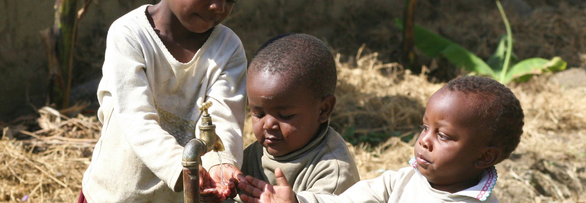

# Tanzanian Water Well Project

Author: David Cruz, Reed Martinson

# Overview 

This project analyzes water wells in Tanzania to help out Humanitarian Relief Co. The Humanitarian Relief Co. (HRC) wants us to create a model that can accurately predict if a water well is functioning or not. In the dataset we analyzed, there were over 55,000 water wells with over 50 features describing each individual water well. We narrowed down some of the data so that there would be less noise in our model. We made six different predictive models and then chose our best model. Our best resullts came from an XG Boost which allowed us to make predictions for those wells. Our goal is to reduce the amount of technicians sent to fix wells.

# Business Problem 

We have been hired by the Humanitarian Relief Co. to help them create a model that can accurately predict if a water well is functioning or not. They want to optimize their use of technicians and send them to the water wells that need repair the most.

# Data Understanding 

We got our dataset from [Taarifa](https://taarifa.org/) and [Tanzanian Ministry of Water](https://www.maji.go.tz/), which had over 50,000 different water wells. We got rid of the variables that we thought would not have an impact on predicting the functionality of water wells. Our main objective for our model was to minimize false positives, which is when our model predicts that a water well is functional but it actually is in need of maintenance. There was much information of the installers/managers of the well. There was also data on the location, quality of the water, and even the source. Much of the data seemed to be repetitive from other columns or not relevant to our target. Some research on certain columns was done in order to better understand the data given.

# Methods 

Going into our modeling, our goal was to minimize false-positives. This mean reducing the times our model predicted a functional well when it was really a non-functional well. This was to insure everyone HRC could get water to everyone with minimal mistakes.

Before we began creating models, we had to clean our data set. We got rid of columns that had no description of the variable or had a lot of overlap with other variables. Our goal, by eliminating those columns, was to simplify our variables so our model would have an easier time predicting well functionality. We narrowed our features down to geographic location, population around the water well,the level above/below sea level and management. We also had data describing the water quality, source, and extraction type. This data would be used to create our models.

We began by using modeless baseline to compare our results to. If we were to predict a functional well all the time, we would be right 54% of the time. We then proceeded to make a couple of models to compare. Decision Tree, Random Forest, and XGBoost models were used. The XGBoost model had the best results (Accuracy, False-Positives, and ROC Score). A grid seaarch was then ran to find the best hyperparameters for our XGBoost model. This tuned our model and gave os the best scores based on the given hyperparameters. Now we could further fine tune our model by exploring the model's threshold. By giving it a higher threshold, the model was able to reduce the amount of false-positives while not sacrificing the accuracy or f1 score too much.

# Results 

Our XG Boost model posted a precision score of 0.88 on the training data and 0.85 on the testing data. The precision score is an indication of our false-positves, so having a high precision score meant lower false positives. The rest are metrics we wern't to focused on but wanted to keep in a decent range. Our accuracy score was 0.76 on the training data and 0.73 on the testing data. Our final f1 score was 0.75 on the training data and 0.71 on the testing data. Although our model does not excel in other metrics, it does an excellent job of reducing false positives while still being an effective model.

*Testing Data Confusion Matrix, ~14k entries*


# Conclusions

- Technicians only have to check 8935 wells out of 14850 from our test set. We would only miss 886 wells (false-positives).
- We were able to make a decent predictive model for HRC
- We were able to keep our false-positives low. This means more people are getting water

# Future Analysis 

For future work, we would work to make our model more accurate and further decrease the amount of false negatives. We want to make sure that the Humanitarian Relief Co. has a reliable model that will not miss any water wells and only report water wells that need maintenance. We would also like to explore other models that would give us more insight on important metrics. This way we can predict functional wells and also say which variables are important in deciding functionality.

# For More Information

Contact: [David Cruz](mailto:dcruzven20@gmail.com)

Contact: [Reed Martinson](mailto:prmartinson@gmail.com)

```
Repository Structure:

├── data                                     # files used in project
├── notebooks                                # folder containing code/project notebooks
	├── David                                # folder for data cleaning and modeling
		├── Work_Notebook.ipynb              # data cleaning and understanding
		└── models.ipynb                     # data modeling with results
      └── Reed                               # folder for data cleaning and modeling
		├── Water_Wells_Models.ipynb         # data modeling with results
		└── Water_Wells_Notebooks.ipynb      # data cleaning and understanding
├── photos                                   # photos used in project
├── .gitignore                               # ignore files
├── FinalNotebook.ipynb                      # final code/project notebook
├── README.md                                # top-level README for reviewers of this project
└── Tanzanian_Water_Wells_pres.pdf           # non-technical presentation slides
```